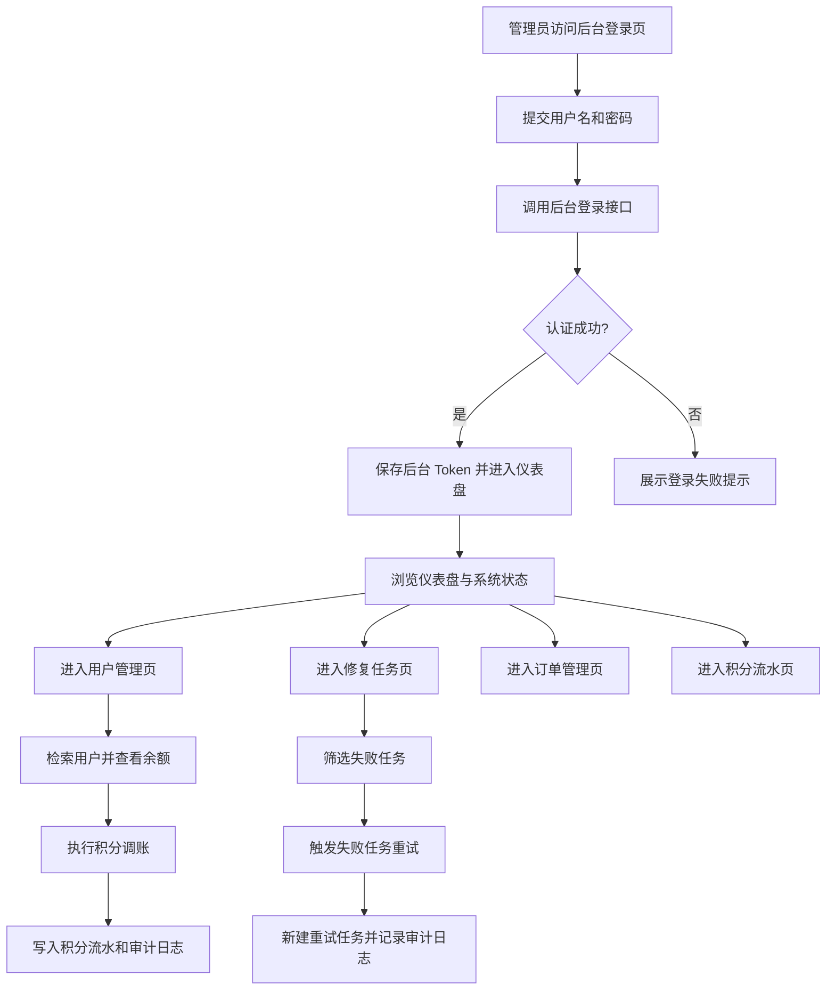

## 1. 产品概述
为 `PictureRepair` 项目新增一个独立的后台管理 Web 端，用于运营、客服和排障人员统一查看用户、修复任务、订单、积分流水和系统运行配置。
- 核心目标是把当前分散在接口和数据库里的排障、调账、任务重试能力沉淀成可视化后台，降低运营支持成本
- 产品价值在于支撑后续真实支付接入、用户运营和异常处理，形成小程序之外的内部运营入口

## 2. 核心功能
### 2.1 用户角色
| 角色 | 登录方式 | 核心权限 |
|------|----------|----------|
| 超级管理员 | 管理员账号密码登录 | 查看全部数据、调账、重试失败任务、查看系统配置与审计日志 |
| 运营人员 | 管理员账号密码登录 | 查看用户/订单/流水/任务，执行积分补偿 |
| 客服/只读人员 | 管理员账号密码登录 | 查看用户、任务、订单、流水与系统状态 |

### 2.2 功能模块
1. **后台登录页**：管理员账号密码登录、登录状态校验、错误反馈
2. **仪表盘**：核心业务指标、今日数据、失败任务总览、系统开关状态
3. **用户管理页**：用户检索、余额查看、积分调账、关联任务与订单查看入口
4. **修复任务页**：任务筛选、失败任务查看、任务详情、失败任务重试
5. **订单管理页**：订单检索、套餐和金额查看、支付方式和状态查看
6. **积分流水页**：充值、导出、调账流水查看，支持按用户和类型过滤
7. **审计日志页**：管理员操作记录查看，追踪调账与任务重试行为
8. **系统配置页**：展示 mock 开关、测试价开关、当前套餐和存储/模型配置

### 2.3 页面详情
| 页面名称 | 模块名称 | 功能说明 |
|-----------|-------------|---------------------|
| 后台登录页 | 登录表单 | 输入管理员用户名和密码，提交后换取后台 token，失败时显示明确错误 |
| 后台登录页 | 登录态恢复 | 若本地已有有效 token，自动跳转到仪表盘 |
| 仪表盘 | 总览指标卡 | 展示总用户数、总任务数、总订单数、总流水数、完成任务数、失败任务数 |
| 仪表盘 | 今日数据区 | 展示今日新增用户、今日任务数、今日导出数、今日订单数、今日收入 |
| 仪表盘 | 系统状态卡 | 展示图片生成 mock、微信登录 mock、测试价开关、当前图片模型 |
| 用户管理页 | 搜索与筛选 | 支持按手机号、昵称检索，分页加载 |
| 用户管理页 | 用户列表 | 展示用户基础信息、余额、注册时间 |
| 用户管理页 | 积分调账弹窗 | 录入加减次数和原因，提交后写入流水和审计日志 |
| 修复任务页 | 任务筛选条 | 支持按状态、任务类型、用户筛选 |
| 修复任务页 | 任务列表 | 展示任务状态、模式、原图、结果图、错误信息、创建时间 |
| 修复任务页 | 失败任务重试 | 对失败任务执行重试，生成新的任务并写审计日志 |
| 订单管理页 | 订单列表 | 展示订单号、用户、套餐、金额、状态、支付方式、创建时间 |
| 订单管理页 | 快速筛选 | 支持按状态、套餐、用户筛选 |
| 积分流水页 | 流水列表 | 展示变动值、变动后余额、类型、关联任务或订单、时间 |
| 积分流水页 | 条件过滤 | 支持按用户、流水类型、关联对象过滤 |
| 审计日志页 | 审计记录 | 展示管理员操作、目标对象、前后变更、原因、时间 |
| 系统配置页 | 配置概览 | 展示当前环境使用的存储类型、图片模型、mock 开关、测试价开关 |
| 系统配置页 | 套餐展示 | 展示当前生效套餐价格和次数，便于联调核对 |

## 3. 核心流程
管理员访问后台登录页，输入账号密码完成认证后进入仪表盘；随后可切换到用户、任务、订单、流水、审计与系统配置页面。

当用户反馈“余额不对”时，运营在用户管理页检索用户，查看余额与流水，必要时执行积分调账；系统同步写入积分流水和后台审计日志。

当存在修复失败任务时，运营或开发在修复任务页按失败状态筛选，查看错误信息后触发任务重试；系统新建任务并在审计日志中保留重试记录。

## 4. 用户界面设计
### 4.1 设计风格
- 主色调采用深咖色、暖米白和灰粉色，延续小程序“老照片修复”的复古品牌气质
- 页面风格偏“编辑台 / 档案馆”质感，卡片和分栏布局结合轻微纹理背景，不走通用 SaaS 蓝白模板
- 标题字体强调稳重和辨识度，正文与表格字体强调可读性和信息密度
- 布局采用桌面优先的左侧导航 + 顶部状态栏 + 主内容区，适合后台高频操作
- 图标以线性图标为主，搭配少量档案夹、时钟、票据、相片框类意象

### 4.2 页面设计概览
| 页面名称 | 模块名称 | UI 元素 |
|-----------|-------------|-------------|
| 后台登录页 | 登录卡片 | 居中悬浮卡片、复古纸张背景、深色主按钮、错误提示条 |
| 仪表盘 | 指标卡组 | 大数字卡片、状态徽章、趋势提示、浅纹理背景 |
| 仪表盘 | 系统状态区 | 开关状态标签、套餐卡片、配置摘要面板 |
| 用户管理页 | 搜索区 | 组合筛选条、圆角输入框、次级按钮 |
| 用户管理页 | 用户表格 | 深浅分层表头、余额标签、快速调账按钮 |
| 修复任务页 | 任务表格 | 状态徽章、错误信息折叠区、图片缩略图、重试按钮 |
| 订单管理页 | 订单表格 | 金额强调色、状态标签、渠道标识 |
| 积分流水页 | 流水表格 | 正负变化高亮、关联对象跳转样式、密集信息布局 |
| 审计日志页 | 时间轴/表格 | 管理员动作、目标对象、前后值摘要、原因说明 |
| 系统配置页 | 配置卡片 | mock 开关标签、套餐卡片、环境说明块 |

### 4.3 响应式
- 采用桌面优先设计，目标分辨率为后台常见的 `1366px+`
- 平板宽度下保持侧边栏可折叠，表格支持横向滚动
- 移动端仅做基础可读适配，不作为主要使用场景

### 4.4 交互与可用性说明
- 关键危险操作如调账和任务重试要有确认弹窗
- 所有筛选操作保留当前条件，便于连续排障
- 关键状态统一使用颜色与文本双重表达，避免仅靠颜色识别
- 数据加载、空状态、接口错误都需要明确反馈，避免“点击没反应”
