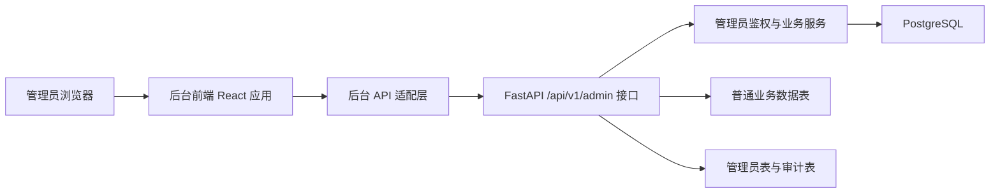
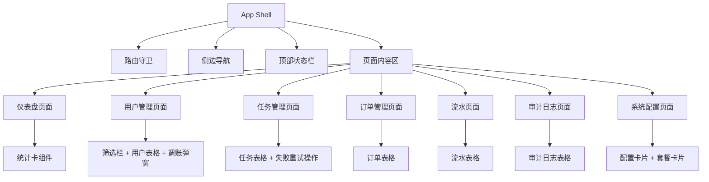
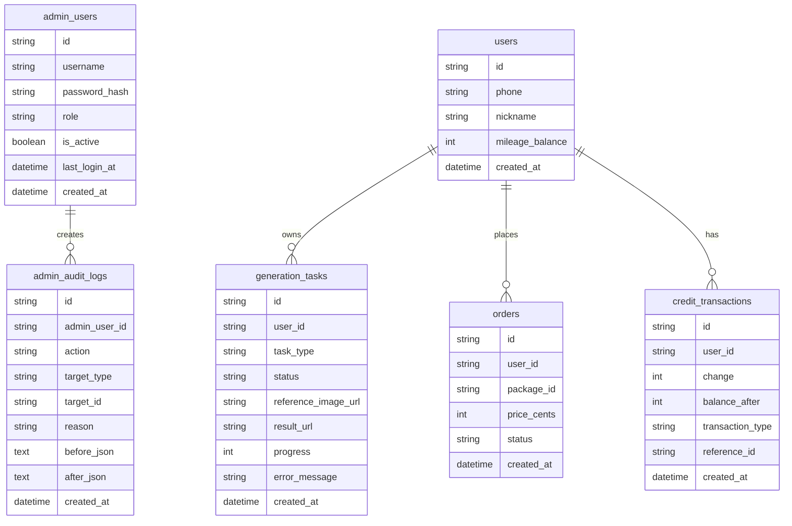

## 1. 架构设计


## 2. 技术说明
- 前端：React 18 + TypeScript + Vite + Tailwind CSS 3
- 路由：React Router 6
- 数据请求：Axios
- 状态管理：React Context + 局部 hooks
- 表格与筛选：原生表格 + 自定义筛选组件，优先减少依赖
- 图表：首版不引第三方图表库，仪表盘使用信息卡和轻量统计块
- 后端：复用现有 FastAPI `admin` 接口
- 启动方式：前端独立目录运行，与小程序分离

## 3. 路由定义
| 路由 | 用途 |
|-------|---------|
| /login | 管理员登录页 |
| /dashboard | 仪表盘 |
| /users | 用户管理 |
| /tasks | 修复任务管理 |
| /orders | 订单管理 |
| /transactions | 积分流水 |
| /audit-logs | 审计日志 |
| /system-config | 系统配置 |

## 4. API 定义
### 4.1 认证相关
```ts
type AdminLoginRequest = {
  username: string
  password: string
}

type AdminProfile = {
  id: string
  username: string
  role: string
  is_active: boolean
  last_login_at?: string
  created_at: string
}

type AdminLoginResponse = {
  access_token: string
  token_type: string
  admin: AdminProfile
}
```

### 4.2 仪表盘
```ts
type AdminDashboardSummary = {
  total_users: number
  total_tasks: number
  total_orders: number
  total_transactions: number
  completed_tasks: number
  failed_tasks: number
  today_new_users: number
  today_tasks: number
  today_exports: number
  today_orders: number
  today_revenue_cents: number
}
```

### 4.3 用户管理
```ts
type AdminUser = {
  id: string
  phone?: string
  openid?: string
  unionid?: string
  nickname?: string
  avatar_url?: string
  mileage_balance: number
  created_at: string
}

type AdminCreditAdjustmentRequest = {
  change: number
  reason: string
}

type AdminCreditAdjustmentResponse = {
  user_id: string
  transaction_id: string
  balance: number
  change: number
  reason: string
}
```

### 4.4 修复任务
```ts
type AdminTask = {
  task_id: string
  user_id?: string
  batch_id?: string
  status: "pending" | "submitted" | "processing" | "downloading" | "completed" | "failed"
  prompt: string
  task_type?: string
  style: string
  aspect_ratio: string
  reference_image_url?: string
  result_url?: string
  progress: number
  error_message?: string
  external_task_id?: string
  created_at?: string
  updated_at?: string
}
```

### 4.5 订单、流水、系统配置
```ts
type AdminOrder = {
  id: string
  user_id: string
  package_id: string
  title: string
  price_cents: number
  credits: number
  status: string
  payment_provider: string
  provider_trade_no?: string
  created_at: string
  paid_at?: string
}

type AdminTransaction = {
  id: string
  user_id: string
  change: number
  balance_after: number
  transaction_type: string
  reference_id?: string
  description?: string
  created_at: string
}

type AdminAuditLog = {
  id: string
  admin_user_id: string
  action: string
  target_type: string
  target_id?: string
  reason?: string
  before_json?: string
  after_json?: string
  created_at: string
}

type CreditPackage = {
  id: string
  title: string
  price_cents: number
  credits: number
}

type AdminSystemConfig = {
  storage_type: string
  image_model: string
  mock_image_generation: boolean
  mock_wechat_login: boolean
  payment_use_test_prices: boolean
  payment_test_price_single_1_cents: number
  payment_test_price_bundle_30_cents: number
  payment_test_price_bundle_90_cents: number
  packages: CreditPackage[]
}
```

## 5. 前端模块架构图


## 6. 数据模型
### 6.1 数据模型定义


### 6.2 数据定义语言
```sql
CREATE TABLE admin_users (
  id VARCHAR PRIMARY KEY,
  username VARCHAR NOT NULL UNIQUE,
  password_hash VARCHAR NOT NULL,
  role VARCHAR NOT NULL DEFAULT 'super_admin',
  is_active BOOLEAN NOT NULL DEFAULT TRUE,
  last_login_at TIMESTAMPTZ NULL,
  created_at TIMESTAMPTZ DEFAULT NOW()
);

CREATE TABLE admin_audit_logs (
  id VARCHAR PRIMARY KEY,
  admin_user_id VARCHAR NOT NULL REFERENCES admin_users(id),
  action VARCHAR NOT NULL,
  target_type VARCHAR NOT NULL,
  target_id VARCHAR NULL,
  reason VARCHAR NULL,
  before_json TEXT NULL,
  after_json TEXT NULL,
  created_at TIMESTAMPTZ DEFAULT NOW()
);

CREATE INDEX ix_admin_users_username ON admin_users(username);
CREATE INDEX ix_admin_audit_logs_action ON admin_audit_logs(action);
CREATE INDEX ix_admin_audit_logs_admin_user_id ON admin_audit_logs(admin_user_id);
CREATE INDEX ix_admin_audit_logs_target_type ON admin_audit_logs(target_type);
CREATE INDEX ix_admin_audit_logs_target_id ON admin_audit_logs(target_id);
```

## 7. 实施约束
- 首版只接现有 `/api/v1/admin/*` 接口，不新增前端需要的新后端能力
- 桌面优先设计，不以移动端为主要交付目标
- 统一做登录拦截、接口错误提示、加载态与空状态
- 不使用 iframe 或低维护成本差的重依赖后台模板
- 保持后台前端和小程序前端彻底隔离，便于后续独立部署
